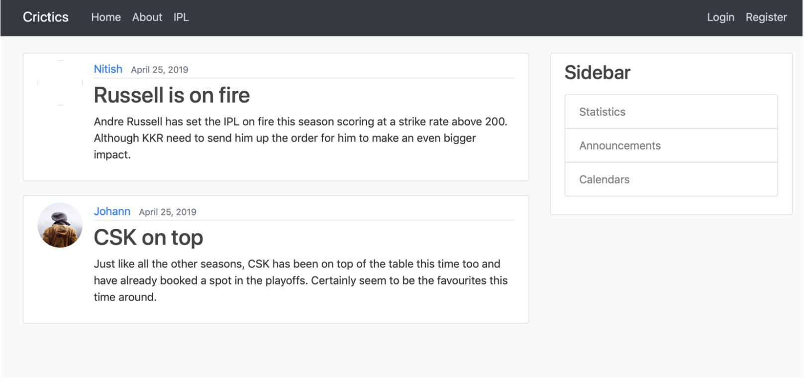
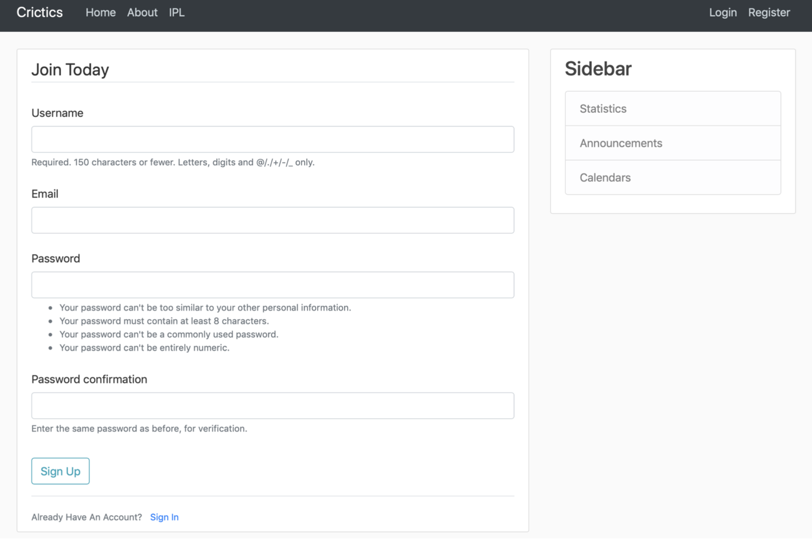
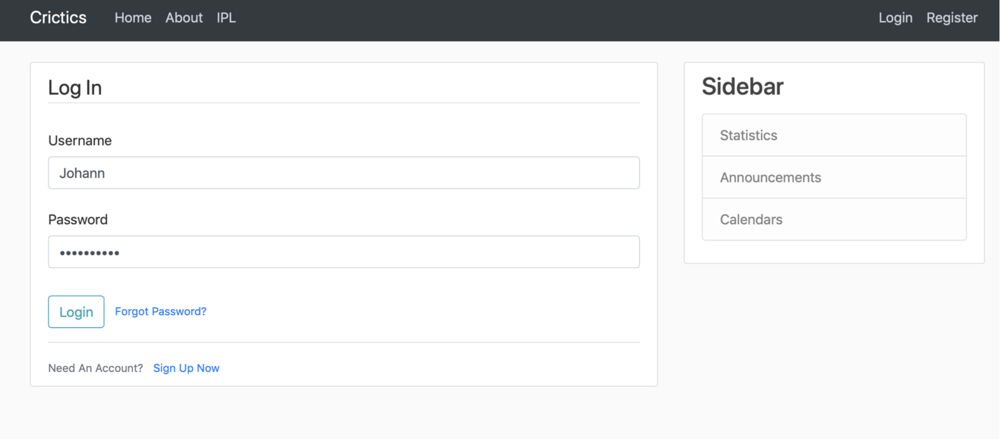
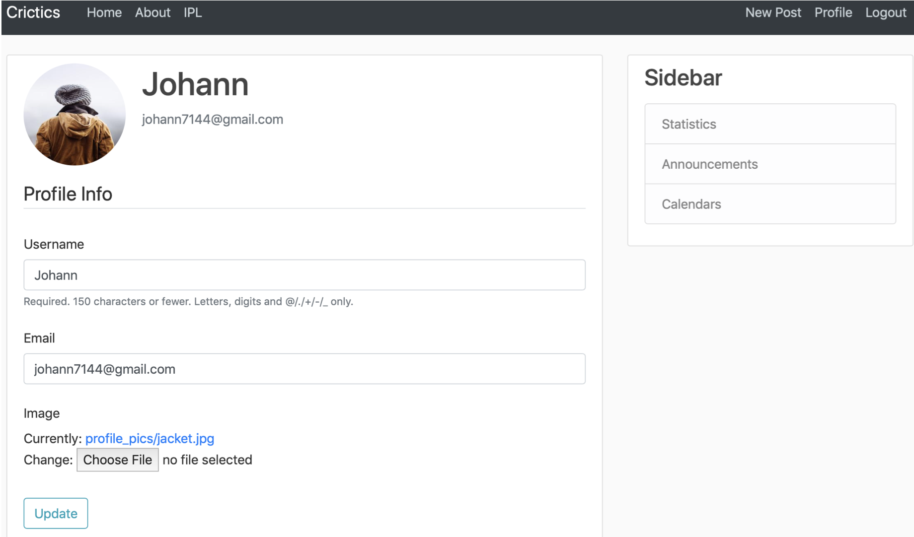
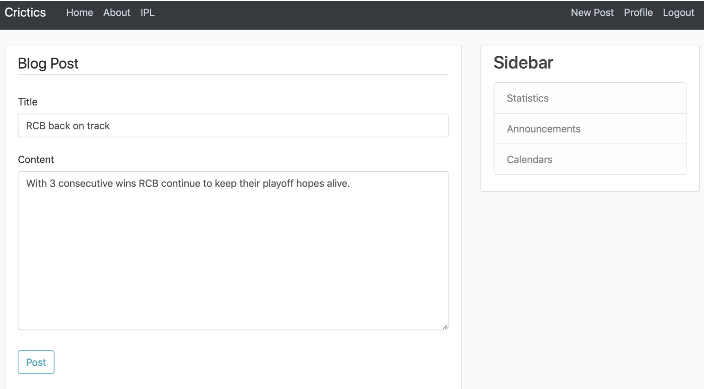
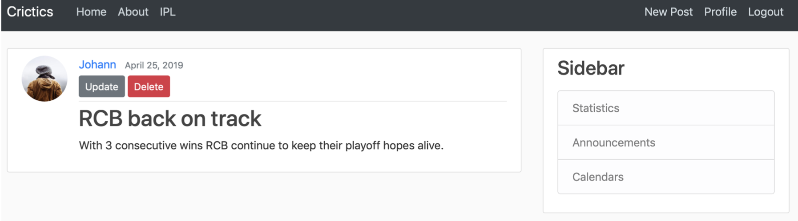

# Cricket-Blog-in-django
Developed a Cricket Blog and Polling app. Also currently creating an IPL page in which i need to include some basic data analysis programs i have written in python. Implemented the website by watching CoreyMS's Youtube Lectures on Django.

Also performed analysis of IPL data using Machine Learning which is included in another repository [IPL Data Analysis](https://github.com/SurajSubramanian/IPL-Data-Analysis)

## Project Structure
- blog app contains the home part and post creation, updation and deletion parts of the app.
- users app contains the login and register modules, profile module and the password reset parts of the app.
- polls app enables users to take part in polls.
- website app is the main app of the project inside which you have the settings.py and urls.py files.

## Setup
I have changed the database connections from the default sqlite database to PostgreSQL and exported all the modes inside the file suraj.py though it is not necessary for the project to run.

The project requires installation of Django ( preferrably in a virtual environment ) and PostgreSQL inside which you need to export the CSV files in Kaggle ( I used Postico ).

## Overview of project

### This is what the home page looks like !

### Users can register and login

### Users can create profiles and update them

### Users can post content and update them

## References 
I did this project by watching CoreyMS's youtube playlist on django.
Also referred the Official Django Documentation
